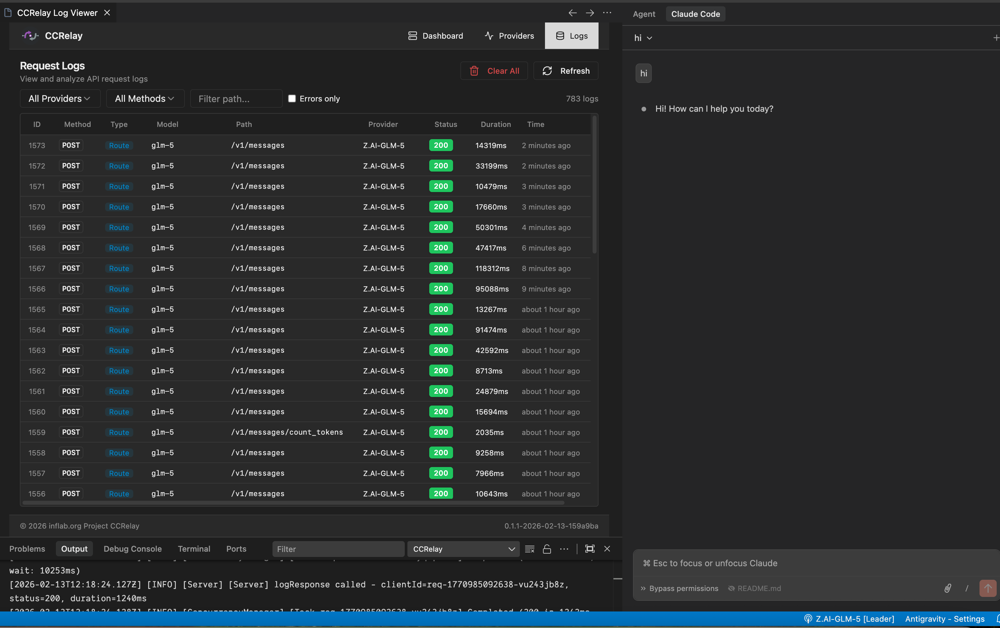
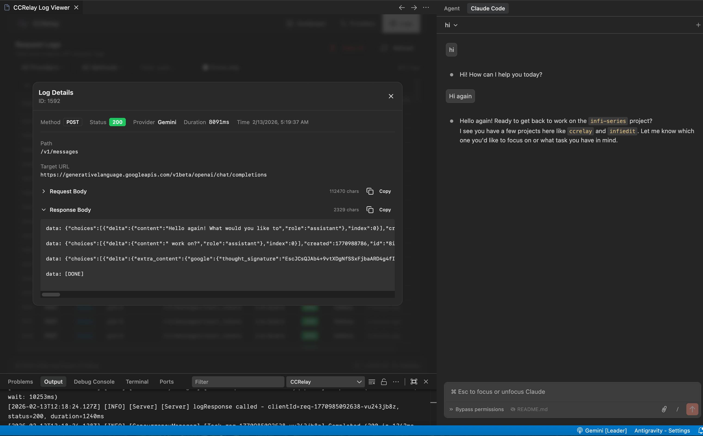

# CCRelay

[](https://code.visualstudio.com/)
[](https://opensource.org/licenses/MIT)

**CCRelay** is a VSCode extension with a built-in API proxy server that allows you to seamlessly switch between different AI providers without losing conversation context. Fully compatible with Claude Code and other Anthropic API clients.

**Website**: [https://ccrelay.inflab.org](https://ccrelay.inflab.org)

**[中文文档 (Chinese Documentation)](./README_CN.md)**

---

## Table of Contents

- [Core Features](#core-features)
- [Requirements](#requirements)
- [Installation](#installation)
- [Quick Start](#quick-start)
- [Usage Guide](#usage-guide)
  - [Basic Setup](#basic-setup)
  - [Multi-Instance Mode](#multi-instance-mode)
  - [Provider Modes](#provider-modes)
  - [Model Mapping](#model-mapping)
  - [OpenAI Format Conversion](#openai-format-conversion)
  - [Web UI Dashboard](#web-ui-dashboard)
- [Configuration](#configuration)
  - [VSCode Settings](#vscode-settings)
  - [YAML Configuration File](#yaml-configuration-file)
- [API Endpoints](#api-endpoints)
- [Commands](#commands)
- [Development](#development)
- [File Locations](#file-locations)
- [License](#license)

---

## Core Features

- **Built-in API Proxy Server**: Runs a local HTTP server (default: `http://127.0.0.1:7575`) that proxies requests to different AI providers
- **Multi-Instance Coordination**: Leader/Follower mode for multiple VSCode windows - only one instance runs the server
- **WebSocket Sync**: Real-time provider synchronization between Leader and Followers via WebSocket
- **Status Bar Indicator**: Shows current provider, role (Leader/Follower), and server status
- **Quick Provider Switching**: Click the status bar or use commands to switch providers
- **Provider Modes**:
  - `passthrough` - Preserves original authentication headers for official API
  - `inject` - Injects provider-specific API Key
- **Model Mapping**: Automatically translates Claude model names to provider-specific models with wildcard support (e.g., `claude-*` → `glm-4.7`)
- **Vision Model Mapping**: Separate model mapping for visual/multimodal requests (`vlModelMap`)
- **OpenAI Format Conversion**: Automatically converts Anthropic API format to OpenAI format, supporting Gemini, OpenRouter, and other OpenAI-compatible APIs
- **Request Logging**: Optional SQLite/PostgreSQL request/response logging with Web UI viewer
- **Concurrency Control**: Built-in request queue and concurrency limits to prevent API overload
- **Auto-start**: Automatically starts the proxy server when VSCode launches

---

## Requirements

- VSCode version 1.80.0 or higher
- Node.js (for development)

---

## Installation

### Install from VSIX

1. Download the latest `.vsix` file
2. In VSCode, press `Cmd+Shift+P` (macOS) or `Ctrl+Shift+P` (Windows/Linux)
3. Type `Extensions: Install from VSIX...`
4. Select the downloaded `.vsix` file

### Build from Source

```bash
# Clone the repository
git clone https://github.com/inflaborg/ccrelay.git
cd ccrelay

# Install dependencies
npm install

# Build the extension
npm run build

# Package VSIX
npm run package
```

### Development Mode

```bash
# Install dependencies
npm install

# Compile
npm run compile

# Press F5 in VSCode to open Extension Development Host window
```

---

## Quick Start

### 1. Configure Claude Code to use the proxy

```bash
export ANTHROPIC_BASE_URL=http://127.0.0.1:7575
claude
```

### 2. Configure providers

CCRelay uses a YAML configuration file (`~/.ccrelay/config.yaml` by default). The file is auto-created with defaults on first launch.

Edit the config file to add your providers:

```yaml
providers:
  glm:
    name: "Z.AI-GLM-5"
    baseUrl: "https://api.z.ai/api/anthropic"
    mode: "inject"
    apiKey: "${GLM_API_KEY}"  # Supports environment variables
    modelMap:
      - pattern: "claude-opus-*"
        model: "glm-5"
      - pattern: "claude-sonnet-*"
        model: "glm-5"
      - pattern: "claude-haiku-*"
        model: "glm-4.7"
    enabled: true

defaultProvider: "glm"
```

### 3. Switch providers

- Click the CCRelay icon in the VSCode status bar at the bottom
- Or use Command Palette: `CCRelay: Switch Provider`

---

## Usage Guide

### Basic Setup

1. Install and enable the extension
2. The config file (`~/.ccrelay/config.yaml`) is auto-created with defaults
3. Edit the config file to add your providers
4. The server will auto-start (configurable via `server.autoStart` in config)
5. Click the status bar to switch providers or access the menu

### Multi-Instance Mode

When multiple VSCode windows are open:

- One instance becomes the **Leader** and runs the HTTP server
- Other instances become **Followers** and connect to the Leader via WebSocket
- Leader broadcasts provider changes to all Followers in real-time
- Followers can request provider switches through the Leader
- If the Leader closes, a Follower automatically becomes the new Leader
- Status bar shows your role: `$(broadcast)` for Leader, `$(radio-tower)` for Follower

### Provider Modes

#### Passthrough Mode (Official Claude API)

- Preserves original authentication headers
- Used for official Claude API with OAuth sessions
- No API key required

#### Inject Mode (Third-party Providers)

- Replaces authentication with provider-specific API Key
- Requires API key configuration
- Supports GLM, OpenRouter, and other Claude-compatible APIs

### Model Mapping

Supports wildcard pattern matching for model names using array format:

```yaml
modelMap:
  - pattern: "claude-opus-*"
    model: "glm-5"
  - pattern: "claude-sonnet-*"
    model: "glm-4.7"
  - pattern: "claude-haiku-*"
    model: "glm-4.5"
```

**Vision Model Mapping**: For requests containing images, you can configure `vlModelMap` separately:

```yaml
modelMap:
  - pattern: "claude-*"
    model: "text-model"
vlModelMap:
  - pattern: "claude-*"
    model: "vision-model"
```

### OpenAI Format Conversion

> 📋 **Feature Note**: OpenAI format conversion enables CCRelay to work with OpenAI-compatible providers (Gemini, OpenRouter, etc.). This feature handles bidirectional conversion between Anthropic and OpenAI API formats. If you encounter any compatibility issues, please report them on GitHub.

CCRelay supports OpenAI-compatible providers (like Gemini):

```yaml
gemini:
  name: "Gemini"
  baseUrl: "https://generativelanguage.googleapis.com/v1beta/openai"
  providerType: "openai"
  mode: "inject"
  apiKey: "${GEMINI_API_KEY}"
  modelMap:
    - pattern: "claude-*"
      model: "gemini-2.5-pro"
```

Conversion process:
- **Request**: Anthropic Messages API format → OpenAI Chat Completions format
- **Response**: OpenAI format → Anthropic format

### Web UI Dashboard

CCRelay has a built-in Web UI dashboard that provides:

- **Dashboard**: Server status, current provider, request statistics
- **Providers**: View and switch providers
- **Logs**: Request/response log viewer (requires enabling log storage)





Access methods:
- Command Palette: `CCRelay: Open Dashboard`
- Browser: `http://127.0.0.1:7575/ccrelay/`

---

## Configuration

CCRelay uses a YAML configuration file (`~/.ccrelay/config.yaml` by default). The file is auto-created with defaults on first launch.

### VSCode Settings

| Setting | Default | Description |
|---------|---------|-------------|
| `ccrelay.configPath` | `~/.ccrelay/config.yaml` | Path to the YAML configuration file |

### YAML Configuration File

#### Server Configuration

| Setting | Default | Description |
|---------|---------|-------------|
| `server.port` | `7575` | Proxy server port |
| `server.host` | `127.0.0.1` | Bind address |
| `server.autoStart` | `true` | Auto-start server when extension loads |

#### Provider Configuration

| Setting | Default | Description |
|---------|---------|-------------|
| `defaultProvider` | `official` | Default provider ID |
| `providers` | `{...}` | Provider configurations |

Each provider supports:
- `name` - Display name
- `baseUrl` - API base URL
- `mode` - `passthrough` or `inject`
- `providerType` - `anthropic` (default) or `openai`
- `apiKey` - API key (inject mode, supports `${ENV_VAR}` environment variables)
- `authHeader` - Authorization header name (default: `authorization`)
- `modelMap` - Model name mappings (array of `{pattern, model}`, supports wildcards)
- `vlModelMap` - Vision model mappings (for multimodal requests)
- `headers` - Custom request headers
- `enabled` - Whether enabled (default: `true`)

#### Routing Configuration

| Setting | Default | Description |
|---------|---------|-------------|
| `routing.proxy` | `["/v1/messages", "/messages"]` | Paths routed to current provider |
| `routing.passthrough` | `["/v1/users/*", "/v1/organizations/*"]` | Paths always going to official API |
| `routing.block` | `[{path: "/api/event_logging/*", ...}]` | Paths returning custom response in inject mode |
| `routing.openaiBlock` | `[{path: "/v1/messages/count_tokens", ...}]` | Block patterns for OpenAI providers |

#### Concurrency Control

| Setting | Default | Description |
|---------|---------|-------------|
| `concurrency.enabled` | `true` | Enable concurrency queue |
| `concurrency.maxWorkers` | `3` | Maximum concurrent workers |
| `concurrency.maxQueueSize` | `100` | Maximum queue size (0 = unlimited) |
| `concurrency.requestTimeout` | `60` | Request timeout in queue (seconds, 0 = unlimited) |
| `concurrency.routes` | `[]` | Per-route queue configuration |

#### Logging Storage

| Setting | Default | Description |
|---------|---------|-------------|
| `logging.enabled` | `false` | Enable request log storage |
| `logging.database.type` | `sqlite` | Database type (`sqlite` or `postgres`) |

**SQLite Configuration:**
| Setting | Default | Description |
|---------|---------|-------------|
| `logging.database.path` | `""` | Database file path (empty = `~/.ccrelay/logs.db`) |

**PostgreSQL Configuration:**
| Setting | Default | Description |
|---------|---------|-------------|
| `logging.database.host` | `localhost` | Server host |
| `logging.database.port` | `5432` | Server port |
| `logging.database.name` | `ccrelay` | Database name |
| `logging.database.user` | `""` | Username |
| `logging.database.password` | `""` | Password (supports `${ENV_VAR}`) |
| `logging.database.ssl` | `false` | Enable SSL connection |

### Complete Configuration Example

```yaml
# CCRelay Configuration
# Docs: https://github.com/inflaborg/ccrelay#configuration

# ==================== Server Configuration ====================
server:
  port: 7575                    # Proxy server port
  host: "127.0.0.1"             # Bind address
  autoStart: true               # Auto-start server when extension loads

# ==================== Provider Configuration ====================
providers:
  official:
    name: "Claude Official"
    baseUrl: "https://api.anthropic.com"
    mode: "passthrough"         # passthrough | inject
    providerType: "anthropic"   # anthropic | openai
    enabled: true

  glm:
    name: "Z.AI-GLM-5"
    baseUrl: "https://api.z.ai/api/anthropic"
    mode: "inject"
    apiKey: "${GLM_API_KEY}"    # Supports environment variables
    authHeader: "authorization"
    modelMap:
      - pattern: "claude-opus-*"
        model: "glm-5"
      - pattern: "claude-sonnet-*"
        model: "glm-5"
      - pattern: "claude-haiku-*"
        model: "glm-4.7"
    enabled: true

  gemini:
    name: "Gemini"
    baseUrl: "https://generativelanguage.googleapis.com/v1beta/openai"
    providerType: "openai"
    mode: "inject"
    apiKey: "${GEMINI_API_KEY}"
    modelMap:
      - pattern: "claude-*"
        model: "gemini-2.5-pro"
    enabled: true

# Default provider ID
defaultProvider: "official"

# ==================== Routing Configuration ====================
routing:
  # Proxy routes: Forward to current provider
  proxy:
    - "/v1/messages"
    - "/messages"

  # Passthrough routes: Always go to official API
  passthrough:
    - "/v1/users/*"
    - "/v1/organizations/*"

  # Block routes (inject mode): Return custom response
  block:
    - path: "/api/event_logging/*"
      response: ""
      code: 200

  # OpenAI format block routes
  openaiBlock:
    - path: "/v1/messages/count_tokens"
      response: '{"input_tokens": 0}'
      code: 200

# ==================== Concurrency Control ====================
concurrency:
  enabled: true                 # Enable concurrency queue
  maxWorkers: 3                 # Maximum concurrent workers
  maxQueueSize: 100             # Maximum queue size (0=unlimited)
  requestTimeout: 60            # Request timeout in queue (seconds)

  # Per-route queue configuration
  routes:
    - pattern: "/v1/messages/count_tokens"
      name: "count_tokens"
      maxWorkers: 30
      maxQueueSize: 1000

# ==================== Logging Storage ====================
logging:
  enabled: true                 # Enable request log storage

  database:
    type: "sqlite"              # sqlite | postgres
    path: ""                    # Empty = ~/.ccrelay/logs.db

    # PostgreSQL configuration
    # type: "postgres"
    # host: "localhost"
    # port: 5432
    # name: "ccrelay"
    # user: ""
    # password: "${POSTGRES_PASSWORD}"
    # ssl: false
```

> **Note**: YAML config supports both `camelCase` and `snake_case` keys.

---

## API Endpoints

The proxy server exposes management endpoints at `/ccrelay/`:

| Endpoint | Method | Description |
|----------|--------|-------------|
| `/ccrelay/api/status` | GET | Get current proxy status |
| `/ccrelay/api/providers` | GET | List all available providers |
| `/ccrelay/api/switch/{id}` | GET | Switch to a provider by ID |
| `/ccrelay/api/switch` | POST | Switch provider (JSON body) |
| `/ccrelay/api/queue` | GET | Get queue statistics |
| `/ccrelay/api/logs` | GET | Get request logs (when logging enabled) |
| `/ccrelay/ws` | WebSocket | Real-time sync for Followers |
| `/ccrelay/` | GET | Web UI dashboard |

All other requests are proxied to the current provider.

---

## Commands

| Command | ID | Description |
|---------|-----|-------------|
| CCRelay: Show Menu | `ccrelay.showMenu` | Show main menu |
| CCRelay: Switch Provider | `ccrelay.switchProvider` | Open provider picker |
| CCRelay: Start Server | `ccrelay.startServer` | Manually start the server |
| CCRelay: Stop Server | `ccrelay.stopServer` | Stop the server |
| CCRelay: Open Settings | `ccrelay.openSettings` | Open extension settings |
| CCRelay: Show Logs | `ccrelay.showLogs` | View output logs |
| CCRelay: Clear Logs | `ccrelay.clearLogs` | Clear output logs |
| CCRelay: Open Dashboard | `ccrelay.openWebUI` | Open dashboard panel |

---

## Development

```bash
# Compile TypeScript
npm run compile

# Watch for changes and recompile
npm run watch

# Run ESLint
npm run lint

# Auto-fix lint issues
npm run lint:fix

# Format code
npm run format

# Run unit tests
npm run test

# Run integration tests
npm run test:integration

# Run all tests
npm run test:all

# Run tests with coverage
npm run test:coverage

# Build VSIX package
npm run package

# Development build
npm run build:dev

# Production build
npm run build:prod
```

### Project Structure

```
ccrelay/
├── src/
│   ├── extension.ts          # Extension entry point
│   ├── api/                  # API endpoint handlers
│   ├── config/               # Configuration management
│   ├── converter/            # Anthropic ↔ OpenAI format conversion
│   ├── database/             # Database drivers (SQLite/PostgreSQL)
│   ├── queue/                # Concurrency control and request queue
│   ├── server/               # HTTP server and routing
│   ├── types/                # TypeScript type definitions
│   ├── utils/                # Utility functions
│   └── vscode/               # VSCode integration (status bar, log viewer)
├── web/                      # Web UI (React + Vite)
├── tests/                    # Test files
└── assets/                   # Extension assets
```

---

## File Locations

| File | Location | Description |
|------|----------|-------------|
| YAML Config | `~/.ccrelay/config.yaml` | Main configuration file (auto-created) |
| Log database | `~/.ccrelay/logs.db` | Request/response logs (when enabled) |

---

## Contributing

Issues and Pull Requests are welcome!

---

## Acknowledgments

This project is **100% AI-generated code**. Special thanks to:

- **[Claude Code](https://claude.ai/code)** - The AI coding assistant that wrote all the code
- **[GLM](https://z.ai/model-api)** - GLM models (glm-4.7, later glm-5) served as the backend provider

---

## License

[MIT License](LICENSE)

Copyright (c) 2026 [inflab.org](https://inflab.org)
