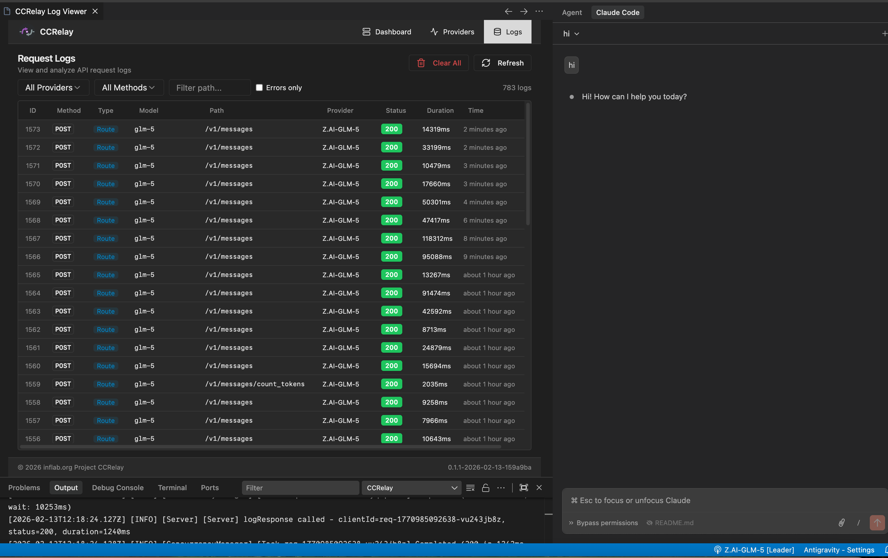
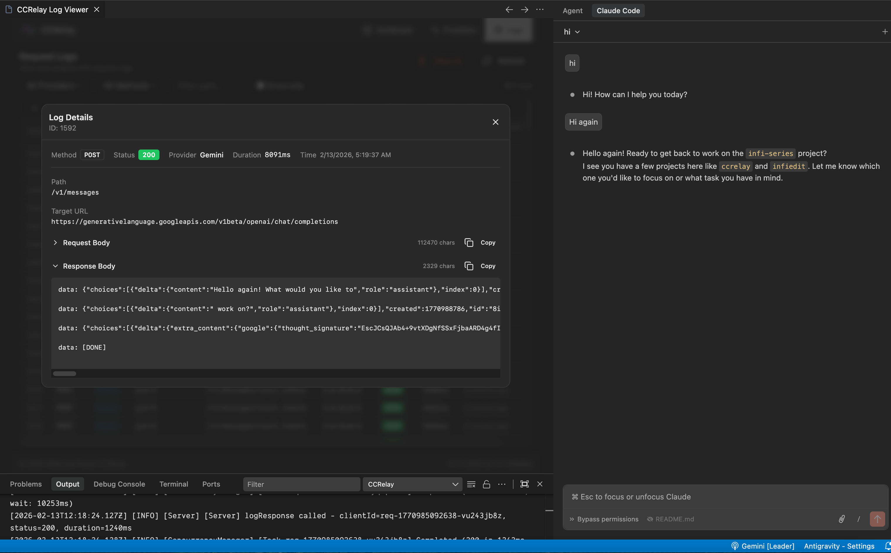

# CCRelay

[](https://code.visualstudio.com/)
[](https://opensource.org/licenses/MIT)

**CCRelay** is a VSCode extension with a built-in API proxy server that allows you to seamlessly switch between different AI providers without losing conversation context. It is designed to work with **Claude Code**, **Claude Cowork**, and **OpenAI Codex** (among other Anthropic- and OpenAI-compatible clients)—see [Client integrations](#client-integrations).

**Website**: [https://ccrelay.inflab.org](https://ccrelay.inflab.org)

**[中文文档 (Chinese Documentation)](./README_CN.md)**

---

## Table of Contents

- [Core Features](#core-features)
- [Requirements](#requirements)
- [Installation](#installation)
- [Quick Start](#quick-start)
- [Client integrations](#client-integrations)
- [Usage Guide](#usage-guide)
  - [Basic Setup](#basic-setup)
  - [Multi-Instance Mode](#multi-instance-mode)
  - [Provider Modes](#provider-modes)
  - [Model Mapping](#model-mapping)
  - [OpenAI Format Conversion](#openai-format-conversion)
  - [Web UI Dashboard](#web-ui-dashboard)
- [Configuration](#configuration)
  - [VSCode Settings](#vscode-settings)
  - [YAML Configuration File](#yaml-configuration-file)
- [API Endpoints](#api-endpoints)
- [Commands](#commands)
- [Development](#development)
- [File Locations](#file-locations)
- [License](#license)

---

## Core Features

- **Built-in API Proxy Server**: Runs a local HTTP server (default: `http://127.0.0.1:7575`) that proxies requests to different AI providers
- **Multi-Instance Coordination**: Leader/Follower mode for multiple VSCode windows - only one instance runs the server
- **WebSocket Sync**: Real-time provider synchronization between Leader and Followers via WebSocket
- **Status Bar Indicator**: Shows current provider, role (Leader/Follower), and server status
- **Quick Provider Switching**: Click the status bar or use commands to switch providers
- **Provider Modes**:
  - `passthrough` - Preserves original authentication headers for official API
  - `inject` - Injects provider-specific API Key
- **Model Mapping**: Automatically translates Claude model names to provider-specific models with wildcard support (e.g., `claude-*` → `glm-4.7`)
- **Vision Model Mapping**: Separate model mapping for visual/multimodal requests (`vlModelMap`)
- **OpenAI Format Conversion (LLM router)**: Accepts Anthropic, OpenAI Chat Completions, and OpenAI Responses (`/v1/responses`); converts when the inbound wire does not match the provider (Chat/Responses are hubbed through Chat Completions for cross-provider routing)
- **Request Logging**: Optional SQLite/PostgreSQL request/response logging with Web UI viewer
- **Concurrency Control**: Built-in request queue and concurrency limits to prevent API overload
- **Auto-start**: Automatically starts the proxy server when VSCode launches
- **Client integrations**: Use the same proxy with **Claude Code**, **Claude Cowork** (Anthropic wire), and **Codex** (OpenAI wire + `~/.codex/config.toml`); see [Client integrations](#client-integrations)

---

## Requirements

- VSCode version 1.80.0 or higher
- Node.js (for development)

---

## Installation

### Install from VSIX

1. Download the latest `.vsix` file
2. In VSCode, press `Cmd+Shift+P` (macOS) or `Ctrl+Shift+P` (Windows/Linux)
3. Type `Extensions: Install from VSIX...`
4. Select the downloaded `.vsix` file

### Build from Source

```bash
# Clone the repository
git clone https://github.com/inflaborg/ccrelay.git
cd ccrelay

# Install dependencies
npm install

# Build the extension
npm run build

# Package VSIX
npm run package
```

### Development Mode

```bash
# Install dependencies
npm install

# Compile
npm run compile

# Press F5 in VSCode to open Extension Development Host window
```

---

## Quick Start

### 1. Configure providers

CCRelay uses a YAML configuration file (`~/.ccrelay/config.yaml` by default). The file is auto-created with defaults on first launch.

Edit the config file to add your providers:

```yaml
providers:
  glm:
    name: "Z.AI-GLM-5"
    baseUrl: "https://api.z.ai/api/anthropic"
    mode: "inject"
    apiKey: "${GLM_API_KEY}"  # Supports environment variables
    modelMap:
      - pattern: "claude-opus-*"
        model: "glm-5"
      - pattern: "claude-sonnet-*"
        model: "glm-5"
      - pattern: "claude-haiku-*"
        model: "glm-4.7"
    enabled: true

defaultProvider: "glm"
```

### 2. Point Claude Code at CCRelay

Set environment variables for Claude Code in **`~/.claude/settings.json`** (an `env` object). The recommended path is a persistent file config—not VS Code workspace settings or ad‑hoc steps in the CCRelay extension. See [Claude Code](#claude-code) for a full `env` example, or use the Web dashboard **Client configuration** to write the same keys.

### 3. Switch providers

- Click the CCRelay icon in the VSCode status bar at the bottom
- Or use Command Palette: `CCRelay: Switch Provider`

---

## Client integrations

**Claude Code**, **Claude Cowork**, and **OpenAI Codex** are first-class target clients. CCRelay exposes an **Anthropic-compatible** API (`/v1/messages`, …) and an **OpenAI-compatible** API (`/v1/chat/completions`, `GET /v1/models`, `POST /v1/responses`, …) on the same port (default **7575**). Point them at the same host and port as in `~/.ccrelay/config.yaml` (default: `http://127.0.0.1:7575`).

| Client | Wire | How to use CCRelay |
|--------|------|--------------------|
| **Claude Code** | Anthropic | Set `ANTHROPIC_BASE_URL` (and optional `ANTHROPIC_DEFAULT_*_MODEL` keys) in `~/.claude/settings.json` → `env` — see [Claude Code](#claude-code) |
| **Claude Cowork** | Anthropic | Configure the app’s **API / Anthropic base URL** to the same CCRelay origin (e.g. `http://127.0.0.1:7575`) so traffic goes through the proxy |
| **Codex** (OpenAI Codex CLI) | OpenAI | Register CCRelay as a **model provider** in `~/.codex/config.toml` (see example below) |

### Claude Code

**Persistent settings (`~/.claude/settings.json`) — recommended**

Add an `env` object so every Claude Code session points at CCRelay. `ANTHROPIC_AUTH_TOKEN` can be a placeholder when CCRelay’s current provider is **inject** mode (CCRelay adds the real upstream key); adjust if your setup requires a real token. **You do not need** `ANTHROPIC_DEFAULT_*_MODEL` here if you are happy with CCRelay’s `modelMap` only—the Web dashboard can append those keys optionally (see below).

```json
{
  "env": {
    "ANTHROPIC_AUTH_TOKEN": "ccrelay_apikey_placehold_do_not_need_to_setup_here",
    "ANTHROPIC_BASE_URL": "http://localhost:7575",
    "API_TIMEOUT_MS": "3000000",
    "CLAUDE_CODE_DISABLE_NONESSENTIAL_TRAFFIC": 1
  }
}
```

**Optional** — per-tier default model *names* Claude Code will request (`ANTHROPIC_DEFAULT_OPUS_MODEL`, `ANTHROPIC_DEFAULT_SONNET_MODEL`, `ANTHROPIC_DEFAULT_HAIKU_MODEL`). CCRelay usually maps `claude-*` via `modelMap` without these. The dashboard’s **Client configuration** → **Configure default models** uses the suggested values below; you can change them in the UI.

If your `settings.json` already has other top-level keys, merge the `"env"` block in (or extend `env` with these keys) instead of replacing the whole file.

Example `env` with optional default model names (same suggestions as the web UI):

```json
{
  "env": {
    "ANTHROPIC_AUTH_TOKEN": "ccrelay_apikey_placehold_do_not_need_to_setup_here",
    "ANTHROPIC_BASE_URL": "http://localhost:7575",
    "API_TIMEOUT_MS": "3000000",
    "CLAUDE_CODE_DISABLE_NONESSENTIAL_TRAFFIC": 1,
    "ANTHROPIC_DEFAULT_OPUS_MODEL": "claude-opus-4-7",
    "ANTHROPIC_DEFAULT_SONNET_MODEL": "claude-sonnet-4-6",
    "ANTHROPIC_DEFAULT_HAIKU_MODEL": "claude-haiku-4-5"
  }
}
```

`http://127.0.0.1:7575` and `http://localhost:7575` are interchangeable for a local CCRelay bind.

**Optional (shell only, not persistent)** — quick test without editing `~/.claude/settings.json`:

```bash
export ANTHROPIC_BASE_URL=http://127.0.0.1:7575
claude
```

For day-to-day use, prefer the `~/.claude/settings.json` `env` block above.

### Claude Cowork

Point **Claude Cowork** at the same **Anthropic base URL** as Claude Code: your CCRelay server root (e.g. `http://127.0.0.1:7575`), not the upstream provider URL. Switch models and backends in the CCRelay VSCode extension or `config.yaml` as usual.

### Codex (`~/.codex/config.toml`)

**Codex** can use CCRelay by defining a custom provider whose `base_url` targets CCRelay’s **OpenAI-compatible** base path (`/v1` on the same host as the proxy).

Example (adjust `model` to one your current CCRelay provider maps, e.g. via `modelMap`):

```toml
# ~/.codex/config.toml
model = "glm-5-turbo"
model_provider = "ccrelay"

[model_providers.ccrelay]
name = "CCRelay"
base_url = "http://localhost:7575/v1"
```

- **`base_url`** must include the `/v1` prefix so Codex calls `http://localhost:7575/v1/...` on the proxy.
- Ensure CCRelay is running (VSCode extension) and the selected provider in CCRelay matches the model routing you need.

---

## Usage Guide

### Basic Setup

1. Install and enable the extension
2. The config file (`~/.ccrelay/config.yaml`) is auto-created with defaults
3. Edit the config file to add your providers
4. The server will auto-start (configurable via `server.autoStart` in config)
5. Click the status bar to switch providers or access the menu

### Multi-Instance Mode

When multiple VSCode windows are open:

- One instance becomes the **Leader** and runs the HTTP server
- Other instances become **Followers** and connect to the Leader via WebSocket
- Leader broadcasts provider changes to all Followers in real-time
- Followers can request provider switches through the Leader
- If the Leader closes, a Follower automatically becomes the new Leader
- Status bar shows your role: `$(broadcast)` for Leader, `$(radio-tower)` for Follower

### Provider Modes

#### Passthrough Mode (Official Claude API)

- Preserves original authentication headers
- Used for official Claude API with OAuth sessions
- No API key required

#### Inject Mode (Third-party Providers)

- Replaces authentication with provider-specific API Key
- Requires API key configuration
- Supports GLM, OpenRouter, and other Claude-compatible APIs

### Model Mapping

Supports wildcard pattern matching for model names using array format:

```yaml
modelMap:
  - pattern: "claude-opus-*"
    model: "glm-5"
  - pattern: "claude-sonnet-*"
    model: "glm-4.7"
  - pattern: "claude-haiku-*"
    model: "glm-4.5"
```

**Vision Model Mapping**: For requests containing images, you can configure `vlModelMap` separately:

```yaml
modelMap:
  - pattern: "claude-*"
    model: "text-model"
vlModelMap:
  - pattern: "claude-*"
    model: "vision-model"
```

### OpenAI Format Conversion (LLM router)

> 📋 **Feature Note**: CCRelay can accept **Anthropic**, **OpenAI Chat Completions**, and **OpenAI Responses** (`/v1/responses`) entry points. Conversion is applied when the inbound wire format does not match the provider’s `providerType` (Chat/Responses are both mapped via a Chat Completions hub when talking to OpenAI-compatible or Anthropic upstreams). When client and upstream are the same family, traffic is passed through (aside from `modelMap` and auth).

**Inbound API surfaces (paths)**

| Path | Method | Client format |
|------|--------|----------------|
| `/v1/messages`, `/messages` | POST | Anthropic Messages |
| `/v1/messages/count_tokens` | POST | Anthropic |
| `/v1/chat/completions` | POST | OpenAI Chat Completions |
| `/v1/responses` | POST | OpenAI Responses API (create) |
| `/v1/models` | GET | OpenAI models list |

`routing.proxy` in `config.yaml` should include the paths you use (defaults include the rows above).

**Conversion rules**

- Client **Anthropic** + provider `providerType: openai`: request A→O, response O→A (same as before).
- Client **OpenAI** (chat) + provider `providerType: anthropic`: request O→A, response A→O.
- Client **OpenAI Responses** + any provider: request is converted to Chat Completions, then to Anthropic if needed; response is converted back to the Responses JSON shape. Hosted-only tools (e.g. web search, MCP) are stripped in v1.
- Same **family** on both sides (e.g. chat + `openai` provider): no format conversion (only model name mapping, etc.).

**OpenAI Chat Completions path** (`openaiChatCompletionsPath`, optional)

When converting to OpenAI Chat Completions (Anthropic → OpenAI, or Responses → Chat as a hub), CCRelay appends a path to `baseUrl`. The default is `/chat/completions` (no extra `/v1` segment in the path). If your `baseUrl` already ends with a version segment (e.g. `https://api.z.ai/api/coding/paas/v4`) and the upstream expects `.../v4/chat/completions` rather than `.../v4/v1/chat/completions`, leave the default or set `openaiChatCompletionsPath: "/chat/completions"` explicitly. If your gateway expects the full OpenAI-style segment (e.g. `baseUrl` is only the host root), set `openaiChatCompletionsPath: "/v1/chat/completions"`.

**Limitations (first iteration)**

- Cross-protocol **streaming** to the upstream is not supported (requests are forced to `stream: false` for conversion). If the **client** still sends `stream: true` on `POST /v1/responses` (e.g. OpenAI Codex), CCRelay **synthesizes** a small SSE with `response.created` / `response.completed` / `[DONE]` so the client SDK can finish; the model output is not token-streamed, only delivered in the final `response.completed` payload.
- If the upstream still returns an SSE response where conversion is required, CCRelay returns a clear error.
- **Responses API (v1)**: `previous_response_id`, `conversation`, and OpenAI-hosted tools are not fully supported; use chat-style function tools when possible.

**Example: OpenAI-compatible provider (Gemini)**

```yaml
gemini:
  name: "Gemini"
  baseUrl: "https://generativelanguage.googleapis.com/v1beta/openai"
  providerType: "openai"
  mode: "inject"
  apiKey: "${GEMINI_API_KEY}"
  modelMap:
    - pattern: "claude-*"
      model: "gemini-2.5-pro"
```

**GET /v1/models** (`modelsListFormat`, optional, default `auto`)

There is no request body, so CCRelay cannot infer whether the client expects an OpenAI- or Anthropic-shaped list. Per provider, `modelsListFormat` controls the **inbound client surface** for this route and the **synthetic list** when the upstream returns an error:

- **`auto`** (default): match `providerType`—same wire as the upstream for successful responses (no unnecessary conversion), and the corresponding list shape for fallback.
- **`openai`**: treat the client as OpenAI (e.g. force OpenAI-shaped list when using an OpenAI HTTP client against an Anthropic upstream).
- **`anthropic`**: treat the client as Anthropic.

If you previously relied on OpenAI-shaped `/v1/models` against an Anthropic provider, set `modelsListFormat: openai` (or use the Web dashboard **GET /v1/models wire** field).

`GET /v1/models` is proxied to the current provider; on upstream error, a minimal list is built from `modelMap` in the chosen format.

### Web UI Dashboard

CCRelay has a built-in Web UI dashboard that provides:

- **Dashboard**: Server status, current provider, request statistics
- **Client configuration** (optional): Set Claude Code’s `~/.claude/settings.json` `env` from the UI (e.g. `ANTHROPIC_BASE_URL`, `ANTHROPIC_AUTH_TOKEN` placeholder) and, if needed, per-tier `ANTHROPIC_DEFAULT_*_MODEL` — see [Claude Code](#claude-code).
- **Providers**: View and switch providers
- **Logs**: Request/response log viewer (requires enabling log storage)

**Client configuration** in the Web UI (same flows as the dashboard’s **Client configuration** / **Configure default models** actions):


**Logs** in the Web UI:





Access methods:
- Command Palette: `CCRelay: Open Dashboard`
- Browser: `http://127.0.0.1:7575/ccrelay/`

---

## Configuration

CCRelay uses a YAML configuration file (`~/.ccrelay/config.yaml` by default). The file is auto-created with defaults on first launch.

### VSCode Settings

| Setting | Default | Description |
|---------|---------|-------------|
| `ccrelay.configPath` | `~/.ccrelay/config.yaml` | Path to the YAML configuration file |

### YAML Configuration File

#### Server Configuration

| Setting | Default | Description |
|---------|---------|-------------|
| `server.port` | `7575` | Proxy server port |
| `server.host` | `127.0.0.1` | Bind address |
| `server.autoStart` | `true` | Auto-start server when extension loads |

#### Provider Configuration

| Setting | Default | Description |
|---------|---------|-------------|
| `defaultProvider` | `official` | Default provider ID |
| `providers` | `{...}` | Provider configurations |

Each provider supports:
- `name` - Display name
- `baseUrl` - API base URL
- `openaiChatCompletionsPath` (optional) - Path for OpenAI Chat Completions when converting to that API (default: `/chat/completions`; use `/v1/chat/completions` if your base URL does not include a version prefix)
- `modelsListFormat` (optional) - `auto` | `openai` | `anthropic` — wire for `GET /v1/models` (default `auto` matches `providerType`)
- `mode` - `passthrough` or `inject`
- `providerType` - `anthropic` (default) or `openai`
- `apiKey` - API key (inject mode, supports `${ENV_VAR}` environment variables)
- `authHeader` - Authorization header name (default: `authorization`)
- `modelMap` - Model name mappings (array of `{pattern, model}`, supports wildcards)
- `vlModelMap` - Vision model mappings (for multimodal requests)
- `headers` - Custom request headers
- `enabled` - Whether enabled (default: `true`)

#### Routing Configuration

| Setting | Default | Description |
|---------|---------|-------------|
| `routing.proxy` | `["/v1/messages", "/messages", "/v1/chat/completions", "/v1/models", "/v1/responses"]` | Paths routed to current provider |
| `routing.passthrough` | `["/v1/users/*", "/v1/organizations/*"]` | Paths always going to official API |
| `routing.block` | `[{path: "/api/event_logging/*", ...}]` | Paths returning custom response in inject mode |
| `routing.openaiBlock` | `[{path: "/v1/messages/count_tokens", ...}]` | Block patterns for OpenAI providers |

#### Concurrency Control

| Setting | Default | Description |
|---------|---------|-------------|
| `concurrency.enabled` | `true` | Enable concurrency queue |
| `concurrency.maxWorkers` | `3` | Maximum concurrent workers |
| `concurrency.maxQueueSize` | `100` | Maximum queue size (0 = unlimited) |
| `concurrency.requestTimeout` | `60` | Request timeout in queue (seconds, 0 = unlimited) |
| `concurrency.routes` | `[]` | Per-route queue configuration |

#### Logging Storage

| Setting | Default | Description |
|---------|---------|-------------|
| `logging.enabled` | `false` | Enable request log storage |
| `logging.database.type` | `sqlite` | Database type (`sqlite` or `postgres`) |

**SQLite Configuration:**
| Setting | Default | Description |
|---------|---------|-------------|
| `logging.database.path` | `""` | Database file path (empty = `~/.ccrelay/logs.db`) |

**PostgreSQL Configuration:**
| Setting | Default | Description |
|---------|---------|-------------|
| `logging.database.host` | `localhost` | Server host |
| `logging.database.port` | `5432` | Server port |
| `logging.database.name` | `ccrelay` | Database name |
| `logging.database.user` | `""` | Username |
| `logging.database.password` | `""` | Password (supports `${ENV_VAR}`) |
| `logging.database.ssl` | `false` | Enable SSL connection |

### Complete Configuration Example

```yaml
# CCRelay Configuration
# Docs: https://github.com/inflaborg/ccrelay#configuration

# ==================== Server Configuration ====================
server:
  port: 7575                    # Proxy server port
  host: "127.0.0.1"             # Bind address
  autoStart: true               # Auto-start server when extension loads

# ==================== Provider Configuration ====================
providers:
  official:
    name: "Claude Official"
    baseUrl: "https://api.anthropic.com"
    mode: "passthrough"         # passthrough | inject
    providerType: "anthropic"   # anthropic | openai
    enabled: true

  glm:
    name: "Z.AI-GLM-5"
    baseUrl: "https://api.z.ai/api/anthropic"
    mode: "inject"
    apiKey: "${GLM_API_KEY}"    # Supports environment variables
    authHeader: "authorization"
    modelMap:
      - pattern: "claude-opus-*"
        model: "glm-5"
      - pattern: "claude-sonnet-*"
        model: "glm-5"
      - pattern: "claude-haiku-*"
        model: "glm-4.7"
    enabled: true

  gemini:
    name: "Gemini"
    baseUrl: "https://generativelanguage.googleapis.com/v1beta/openai"
    providerType: "openai"
    mode: "inject"
    apiKey: "${GEMINI_API_KEY}"
    modelMap:
      - pattern: "claude-*"
        model: "gemini-2.5-pro"
    enabled: true

# Default provider ID
defaultProvider: "official"

# ==================== Routing Configuration ====================
routing:
  # Proxy routes: Forward to current provider
  proxy:
    - "/v1/messages"
    - "/messages"

  # Passthrough routes: Always go to official API
  passthrough:
    - "/v1/users/*"
    - "/v1/organizations/*"

  # Block routes (inject mode): Return custom response
  block:
    - path: "/api/event_logging/*"
      response: ""
      code: 200

  # OpenAI format block routes
  openaiBlock:
    - path: "/v1/messages/count_tokens"
      response: '{"input_tokens": 0}'
      code: 200

# ==================== Concurrency Control ====================
concurrency:
  enabled: true                 # Enable concurrency queue
  maxWorkers: 3                 # Maximum concurrent workers
  maxQueueSize: 100             # Maximum queue size (0=unlimited)
  requestTimeout: 60            # Request timeout in queue (seconds)

  # Per-route queue configuration
  routes:
    - pattern: "/v1/messages/count_tokens"
      name: "count_tokens"
      maxWorkers: 30
      maxQueueSize: 1000

# ==================== Logging Storage ====================
logging:
  enabled: true                 # Enable request log storage

  database:
    type: "sqlite"              # sqlite | postgres
    path: ""                    # Empty = ~/.ccrelay/logs.db

    # PostgreSQL configuration
    # type: "postgres"
    # host: "localhost"
    # port: 5432
    # name: "ccrelay"
    # user: ""
    # password: "${POSTGRES_PASSWORD}"
    # ssl: false
```

> **Note**: YAML config supports both `camelCase` and `snake_case` keys.

---

## API Endpoints

The proxy server exposes management endpoints at `/ccrelay/`:

| Endpoint | Method | Description |
|----------|--------|-------------|
| `/ccrelay/api/status` | GET | Get current proxy status |
| `/ccrelay/api/providers` | GET | List all available providers |
| `/ccrelay/api/switch/{id}` | GET | Switch to a provider by ID |
| `/ccrelay/api/switch` | POST | Switch provider (JSON body) |
| `/ccrelay/api/queue` | GET | Get queue statistics |
| `/ccrelay/api/logs` | GET | Get request logs (when logging enabled) |
| `/ccrelay/ws` | WebSocket | Real-time sync for Followers |
| `/ccrelay/` | GET | Web UI dashboard |

All other requests are proxied to the current provider.

---

## Commands

| Command | ID | Description |
|---------|-----|-------------|
| CCRelay: Show Menu | `ccrelay.showMenu` | Show main menu |
| CCRelay: Switch Provider | `ccrelay.switchProvider` | Open provider picker |
| CCRelay: Start Server | `ccrelay.startServer` | Manually start the server |
| CCRelay: Stop Server | `ccrelay.stopServer` | Stop the server |
| CCRelay: Open Settings | `ccrelay.openSettings` | Open extension settings |
| CCRelay: Show Logs | `ccrelay.showLogs` | View output logs |
| CCRelay: Clear Logs | `ccrelay.clearLogs` | Clear output logs |
| CCRelay: Open Dashboard | `ccrelay.openWebUI` | Open dashboard panel |

---

## Development

```bash
# Compile TypeScript
npm run compile

# Watch for changes and recompile
npm run watch

# Run ESLint
npm run lint

# Auto-fix lint issues
npm run lint:fix

# Format code
npm run format

# Run unit tests
npm run test

# Run integration tests
npm run test:integration

# Run all tests
npm run test:all

# Run tests with coverage
npm run test:coverage

# Build VSIX package
npm run package

# Development build
npm run build:dev

# Production build
npm run build:prod
```

### Project Structure

```
ccrelay/
├── src/
│   ├── extension.ts          # Extension entry point
│   ├── api/                  # API endpoint handlers
│   ├── config/               # Configuration management
│   ├── converter/            # Anthropic ↔ OpenAI format conversion
│   ├── database/             # Database drivers (SQLite/PostgreSQL)
│   ├── queue/                # Concurrency control and request queue
│   ├── server/               # HTTP server and routing
│   ├── types/                # TypeScript type definitions
│   ├── utils/                # Utility functions
│   └── vscode/               # VSCode integration (status bar, log viewer)
├── web/                      # Web UI (React + Vite)
├── tests/                    # Test files
└── assets/                   # Extension assets
```

---

## File Locations

| File | Location | Description |
|------|----------|-------------|
| YAML Config | `~/.ccrelay/config.yaml` | Main configuration file (auto-created) |
| Log database | `~/.ccrelay/logs.db` | Request/response logs (when enabled) |

---

## Contributing

Issues and Pull Requests are welcome!

---

## Acknowledgments

This project is **100% AI-generated code**. Special thanks to:

- **[Claude Code](https://claude.ai/code)** - The AI coding assistant that wrote all the code
- **[GLM](https://z.ai/model-api)** - GLM models (glm-4.7, later glm-5) served as the backend provider

---

## License

[MIT License](LICENSE)

Copyright (c) 2026 [inflab.org](https://inflab.org)
